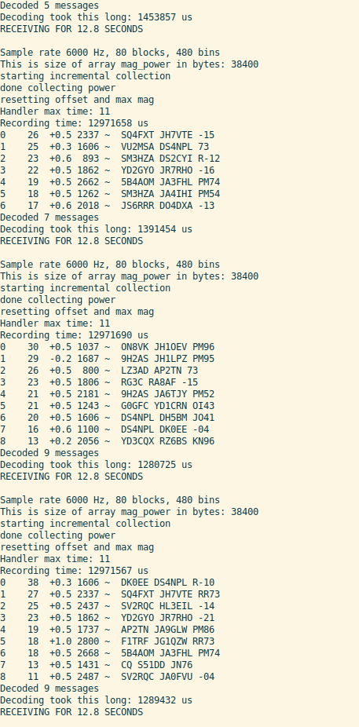
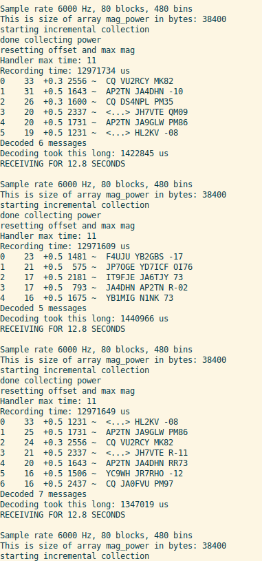

### RPi Pico FT8 Transceiver

Code to run a standalone FT8 transceiver based on the new Raspberry Pi Pico
RP2040 microcontroller. Implemented in C, based on Karlis Goba YL3JG's FT8
Library.

Currently, it is able to decode live audio signals that are input into the ADC
(GPIO 26), displaying them on the serial port.

This firmware is written for the [PDX++ project](https://github.com/kholia/Easy-Transceiver/tree/master/PDX++).

Author 1: Godwin Duan (AA1GD)

Author 2: Dhiru Kholia (VU3CER)


#### Hardware Requirements

- Raspberry Pi Pico (or a compatible) board

- [Option 1 - Preferred] `DFRobot Fermion: MEMS Microphone Module`

- [Option 2 - Fallback] Adafruit - Silicon MEMS Microphone Breakout - SPW2430

  Alternate: Any electret microphone module with analog output should also be
  OK.

- Jumper wires


#### Connections

Si5351 (used for TX):

- SDA to GPIO16
- SCL to GPIO17

ADC on GPIO26. I use the `DFRobot Fermion: MEMS Microphone Module` in my
testing. The FT8 audio is fed externally into this microphone.


#### Build Steps

Follow https://github.com/raspberrypi/pico-sdk#quick-start-your-own-project

```
mkdir -p ~/repos

cd ~/repos

git clone https://github.com/raspberrypi/pico-sdk.git

export PICO_SDK_PATH=${HOME}/repos/pico-sdk

git clone https://github.com/kholia/pico_ft8_xcvr.git

cd pico_ft8_xcvr

cmake .

make
```

Done. At the end of this process a `run_ft8.uf2` file is generated which can be
uploaded to the Pico board.


#### Testing

Live decoding works great with the audio feed coming from a uBITX transceiver.



Pico (in ML76 grid) even decoded a US station - lucky timing!



```
$ ./decode_ft8 tests/191111_110700.wav
Sample rate 12000 Hz, 180000 samples, 15.000 seconds
Block size = 1920
Subblock size = 960
N_FFT = 3840
Max magnitude: -16.9 dB
000000  31 +1.52 1244 ~  DG0OFT W4FGA EM83
000000  31 +1.60 1953 ~  JH1AJT RK6AH 73
000000  31 +1.76  519 ~  IZ1ANK PC2J R+10
000000  30 +1.52  841 ~  CQ OR18RSX
000000  30 +1.76 2359 ~  LA2GCA F5MXH JN07
000000  29 +1.52 1034 ~  CQ EA3UV JN01
000000  28 +2.00 2728 ~  CQ DX IK0YVV JN62
000000  27 +1.52 1725 ~  JH1AJT SP8BJU -04
000000  27 +0.16  972 ~  JA2GQT SP7XIF JO91
000000  25 +1.52 2028 ~  JL1TZQ R3BV R-12
000000  24 +2.24 1403 ~  RK6AUV SV1GN RR73
000000  22 +1.60 1669 ~  CQ PB5DX JO22
000000  19 +1.60 1484 ~  SP8NFO PA3EPP +04
000000  18 +0.96 1112 ~  CQ JR5MJS PM74
Decoded 14 message
```

```
$ sox tests/191111_110700.wav -r 6000 sample.wav

$ ls -la sample.wav tests/191111_110700.wav
-rw-rw-r-- 1 dhiru dhiru 180044 Apr 12 21:22 sample.wav
-rw-rw-r-- 1 dhiru dhiru 360202 Jul  3  2021 tests/191111_110700.wav

$ ./decode_ft8 sample.wav
Sample rate 6000 Hz, 90000 samples, 15.000 seconds
Block size = 960
Subblock size = 480
N_FFT = 1920
Max magnitude: -16.9 dB
000000  31 +1.76  519 ~  IZ1ANK PC2J R+10
000000  31 +1.60 1953 ~  JH1AJT RK6AH 73
000000  31 +1.52 1244 ~  DG0OFT W4FGA EM83
000000  30 +1.52  841 ~  CQ OR18RSX
000000  30 +1.76 2359 ~  LA2GCA F5MXH JN07
000000  29 +1.52 1034 ~  CQ EA3UV JN01
000000  28 +2.00 2728 ~  CQ DX IK0YVV JN62
000000  27 +0.16  972 ~  JA2GQT SP7XIF JO91
000000  27 +1.52 1725 ~  JH1AJT SP8BJU -04
000000  25 +1.52 2028 ~  JL1TZQ R3BV R-12
000000  24 +2.24 1403 ~  RK6AUV SV1GN RR73
000000  22 +1.60 1669 ~  CQ PB5DX JO22
000000  19 +1.60 1484 ~  SP8NFO PA3EPP +04
000000  18 +1.04 1112 ~  CQ JR5MJS PM74
Decoded 14 messages
```

```
$ make -f Makefile.PC

$ ./pc sample.wav  # with upstream values
Sample rate 6000 Hz, 90000 samples, 15.000 seconds
Block size = 960
Subblock size = 480
N_FFT = 1920
Max magnitude: -16.9 dB
000000  31 +1.76  519 ~  IZ1ANK PC2J R+10
000000  31 +1.60 1953 ~  JH1AJT RK6AH 73
000000  31 +1.52 1244 ~  DG0OFT W4FGA EM83
000000  30 +1.52  841 ~  CQ OR18RSX
000000  30 +1.76 2359 ~  LA2GCA F5MXH JN07
000000  29 +1.52 1034 ~  CQ EA3UV JN01
000000  28 +2.00 2728 ~  CQ DX IK0YVV JN62
000000  27 +0.16  972 ~  JA2GQT SP7XIF JO91
000000  27 +1.52 1725 ~  JH1AJT SP8BJU -04
000000  25 +1.52 2028 ~  JL1TZQ R3BV R-12
000000  24 +2.24 1403 ~  RK6AUV SV1GN RR73
000000  22 +1.60 1669 ~  CQ PB5DX JO22
000000  19 +1.60 1484 ~  SP8NFO PA3EPP +04
000000  18 +1.04 1112 ~  CQ JR5MJS PM74
Decoded 14 messages
```

```
With following settings:

#define kLDPC_iterations 10 // Original was 20
#define kMax_decoded_messages 14 // Was 50, change to 14 since there's 14 buttons on the 4x4 membrane keyboard
#define kFreq_osr 1 // both default 2
#define kTime_osr 1

$ ./pc tests/recordings/191111_110700.wav
Sample rate 12000 Hz, 180000 samples, 15.000 seconds
Block size = 1920
Subblock size = 1920
N_FFT = 1920
Max magnitude: -16.3 dB
000000  34 +0.00  975 ~  JA2GQT SP7XIF JO91
000000  29 +1.60 2356 ~  LA2GCA F5MXH JN07
000000  29 +1.44 1956 ~  JH1AJT RK6AH 73
000000  25 +2.08 1406 ~  RK6AUV SV1GN RR73
000000  23 +1.60  519 ~  IZ1ANK PC2J R+10
000000  22 +1.44 1725 ~  JH1AJT SP8BJU -04
000000  20 +1.76 2731 ~  CQ DX IK0YVV JN62
000000  18 +1.28 1038 ~  CQ EA3UV JN01
Decoded 8 messages
```

Question: Can we feed `tests/recordings/191111_110700.wav` into the ADC port of
Pico, and confirm that it too decodes these 8 messages just fine?


#### Misc Notes

Folks have done FT8 decoding on STM32F7, and Teensy 3.6 before.

However, STM32 stuff is unobtanium (and expensive) in year 2022. At almost half
the Teensy 3.6's price point, the RPi 2W is a much better platform for decoding
FT8 and also happens to be unobtanium!

Besides these points, decoding FT8 in real-time on a 4 USD Pi Pico (Arm
Cortex-M0+ Inside) microcontroller with < 150mA current consumption sounds like
fun :-)

The `microphone_adc` example is borrowed from the `pico-extras` repository. It
is quite helpful for debugging stuff.

FT8 TX works fine from CLK 1 (VFO 1) port.


#### Done

- Test the FT8 RX functionality with CD2003 / TA2003 circuit.

  Result: The output of CD2003 is not enough for the Pico's ADC. Use a small
  single transistor pre-amplifier (from Gajendra Sir - VU2BGS) to solve this
  problem.

- Use Pico W for `spotting` - done as part of `SunshineFT8` project.


#### TODO

- Use `Serial2` to send the decoded output to an Android phone / RPi.

- Implement CAT control to get commands (e.g. TX on, PTT on) from an Android
  phone / RPi.

- Keep monitoring the upstream `pico_ft8_xcvr` project for changes.

- [LP] Shift to the new `monitor_t` paradigm (frame processing)


#### References

- https://www.cnx-software.com/2022/07/03/getting-started-with-wifi-on-raspberry-pi-pico-w-board/
