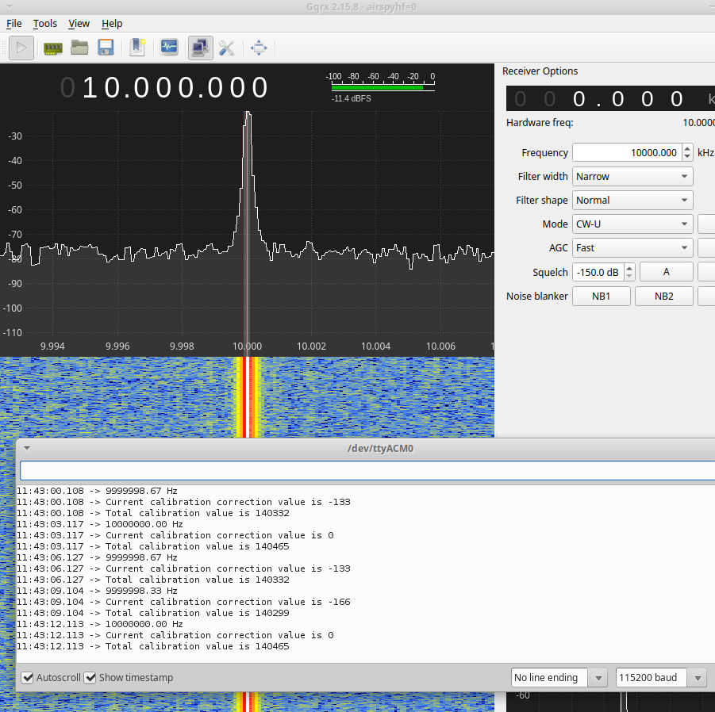
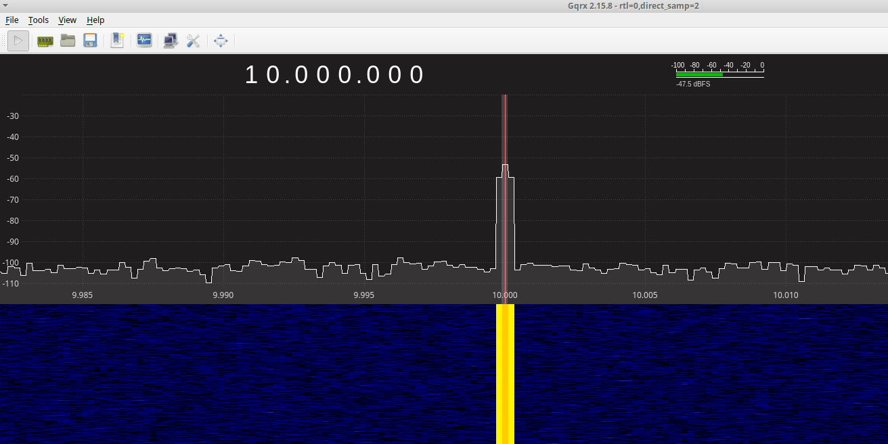

#### What

Traditionally Si5351 calibration has required an external SDR or frequency
counter. In our PDX (PDX++) design, we implement a frequency counter on the
Pico micro-controller itself, and feed it with CLK2 signal from the Si5351.
This way are able to calibrate Si5351 natively without requiring external
hardware.

#### Connections

Note: GP16 is SDA. GP17 is SCL. GP9 is the frequency input.

Automatic calibration is implemented - Wait for around a minute for it to kick
in ;)

#### Credits

- Burkhard Kainka - RPi Pico Projects and Circuits

- WB2CBA, Dr. Pedro, Alan (ADX + PDX team)

- https://github.com/earlephilhower/arduino-pico

- https://github.com/etherkit/Si5351Arduino/blob/master/src/si5351.cpp
